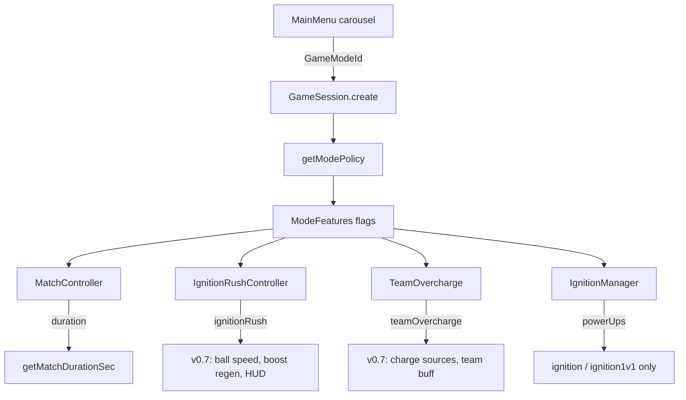

# Ignite — playlisty trybów (Core vs Experimental)

**Cel:** Core Soccar ma zawsze czuć się jak Rocket League. Wszystko, co zmienia gameplay poza klasycznym soccar, idzie najpierw do playlist **Experimental** lub **Weekly Lab** — i dopiero po walidacji może trafić do Core.

**Implementacja:** `src/game/modePolicy.ts` · testy: `tests/modes/modePolicy.test.ts`

**Powiązane:** [`PRODUCT-ROADMAP.md`](PRODUCT-ROADMAP.md) (co budujemy) · [`IGNITION.md`](IGNITION.md) (power-upy FFA) · [FAQ dla playtestera](#faq-dla-playtestera) (bez technikaliów)

---

## Trzy playlisty

| Playlist | `ModeFamily` | Tryby (`GameModeId`) | Gameplay |
|----------|--------------|----------------------|----------|
| **Core Soccar** | `coreSoccar` | `1v1`, `2v2`, `3v3`, `4v4` | Czysty RL: brak power-upów, rush, overcharge, stref, mutatorów, body traits |
| **Experimental** | `experimental` | `ignitionRush2v2`, `ignition1v1`, `ignition` | Nowe mechaniki + legacy Ignition FFA (Rumble) |
| **Weekly Lab** | `lab` | `weeklyLab2v2` | Experimental + rotujący mutator tygodnia (`weeklyMutator`) |

W menu głównym karuzela ma nagłówki sekcji (Core / Experimental / Weekly Lab). Karty spoza Core mają badge **EXP**.

**Online ranked** nadal tylko `1v1` i `2v2` — patrz `server/roomLogic.ts`.

---

## Diagram przepływu



---

## Identyfikatory trybów

Definicja speców (gracze, team size, FFA): `src/game/modes.ts` → `MODE_SPECS`.

| ID | Etykieta (PL menu) | Gracze | Drużyny | C:/Czas meczu |
|----|--------------------|--------|---------|---------------|
| `1v1` | 1v1 Duel | 2 | 1v1 | 5 min |
| `2v2` | 2v2 Doubles | 4 | 2v2 | 5 min |
| `3v3` | 3v3 Standard | 6 | 3v3 | 5 min |
| `4v4` | 4v4 Chaos | 8 | 4v4 | 5 min |
| `ignitionRush2v2` | Ignition Rush 2v2 | 4 | 2v2 | **7 min** |
| `ignition1v1` | Ignition Test | 2 | FFA | 5 min |
| `ignition` | Ignition | 8 | FFA | 5 min |
| `weeklyLab2v2` | Weekly Lab 2v2 | 4 | 2v2 | **7 min** |

Kickoff drużynowy (`buildRlKickoffSpawns`) działa dla każdego trybu z `isFFA: false` — wystarczy `teamSize` w specie.

---

## Flagi funkcji (`ModeFeatures`)

Jedyny punkt prawdy o tym, **co wolno w danym trybie**:

| Flaga | Opis | Core | Rush 2v2 | Lab 2v2 | Ignition FFA |
|-------|------|:----:|:--------:|:-------:|:------------:|
| `powerUps` | Rumble power-upy (`IgnitionManager`) | — | — | — | ✓ |
| `ignitionRush` | Fazy Rush (szybsza piłka, regen boost) | — | ✓ | ✓ | — |
| `teamOvercharge` | Pasek charge drużyny → Overcharge | — | ✓ | ✓ | — |
| `ignitionZones` | Strefy pola (Low Grav, Magnetic…) | — | ✓ | ✓ | — |
| `bodyTraits` | Karoseria wpływa na handling (v0.8+) | — | ✓ | ✓ | — |
| `weeklyMutator` | Rotujący mutator tygodnia | — | — | ✓ | — |

**API:**

```typescript
import { getModePolicy, getMatchDurationSec } from "../game/modePolicy";
import { modeHasPowerUps } from "../game/modes";

const policy = getModePolicy("ignitionRush2v2");
if (policy.features.ignitionRush) { /* ... */ }

modeHasPowerUps("ignition"); // true — deleguje do policy.features.powerUps
```

**Nie używaj** `isIgnitionMode()` do włączania nowych mechanik v0.7 — ta funkcja oznacza tylko legacy FFA (`ignition` / `ignition1v1`).

---

## Moduły w kodzie

| Warstwa | Plik | Rola |
|---------|------|------|
| Policy | `src/game/modePolicy.ts` | Rodzina playlist, feature flags, czas meczu, kolejność menu |
| Spec trybu | `src/game/modes.ts` | `GameModeId`, `ModeSpec`, i18n keys, `parseGameMode` |
| Mecz | `src/modes/MatchController.ts` | Fazy, score, spawn — `getMatchDurationSec(mode)` przy starcie |
| Sesja | `src/game/GameSession.ts` | Tworzy kontrolery wg policy; tick `rush` / `overcharge` w fazie `playing` |
| Rush (v0.7) | `src/modes/IgnitionRushController.ts` | Maszyna stanów `normal` ↔ `rush` (co 90 s, 20 s trwania) |
| Overcharge (v0.7) | `src/modes/TeamOvercharge.ts` | Charge per drużyna, trigger, cooldown |
| Body traits (v0.8) | `src/meta/carBodyTraits.ts` | `bodyStyle` → RamHit / AeroSnap / PivotBoost / ShockwaveDemo |
| Broadcast (v0.9) | `src/visual/matchDirector/MatchDirector.ts`, `goalSpectacle.ts` | Auto-kamera + Goal Spectacle v2 |
| Power-upy FFA | `src/modes/IgnitionManager.ts` | Tylko gdy `features.powerUps` |
| Menu | `src/ui/MainMenu.ts` | Sekcje playlist, badge EXP |
| i18n | `src/i18n/locales/{pl,en}.ts` | `mode.*`, `menu.playlist.*` |
| Testy | `tests/modes/modePolicy.test.ts` | Regresja flag i kolejności menu |

### Stan implementacji (2026-07-16)

| Element | Status |
|---------|--------|
| Policy + menu + nowe ID trybów | ✅ |
| Szkielety Rush / Overcharge + tick w sesji | ✅ |
| Rush → fizyka piłki / regen boost | ✅ |
| Overcharge → źródła charge (save, demo, dribble) | ✅ |
| HUD (banner RUSH, pasek overcharge) | ✅ |
| Ignition Zones | ✅ (buff w środku → respawn losowy) |
| Body Identity (v0.8) | ✅ (`bodyTraits` w Rush / Lab) |
| Broadcast (v0.9) | ✅ Match Director + Goal Spectacle v2 |
| Pit & Collection (v0.10) | ✅ Team Pit 3-slot + provenance + zakładka Kolekcja |
| Weekly mutator (logika rotacji) | ✅ v0.11 (`MutatorRegistry` + Lab) |
| Duel Contracts (BO3 + reward) | ✅ v0.11 (`duelContract` + lobby) |

Nowy kod gameplay **zawsze** owijaj w `if (getModePolicy(mode).features.<flag>)` — nigdy twardo po `mode === "2v2"`.

---

## Jak dodać nowy tryb

1. **`GameModeId`** — rozszerz union w `src/game/modes.ts`.
2. **`MODE_SPECS`** — `playerCount`, `teamSize`, `isFFA`, domyślne opisy (i18n nadpisze w UI).
3. **`POLICIES`** w `modePolicy.ts` — przypisz `family`, `features`, `matchDurationSec`.
4. **`menuModeSections()`** — włóż ID do właściwej sekcji menu.
5. **i18n** — klucze `mode.<id>.label` i `mode.<id>.description` w `pl.ts` / `en.ts`.
6. **UI** — `MODE_ACCENT` w `MainMenu.ts`, `MODE_ICON` w `menuIcons.ts`.
7. **Online** — wszystkie tryby z `menuModeOrder()` są w `server/roomLogic.ts` (`resolveOnlineMode` / `onlineMaxPlayers`, max 8 slotów). Puste sloty = boty u hosta. Ranked tylko 1v1/2v2.
8. **Test** — wpis w `tests/modes/modePolicy.test.ts`.

Spawn/kickoff: dla trybów drużynowych wystarczy poprawny `teamSize` — osobna gałąź w `buildSpawnPositions` nie jest potrzebna, chyba że niestandardowy layout.

---

## Promocja z Experimental → Core

Kryteria (z [`PRODUCT-ROADMAP.md`](PRODUCT-ROADMAP.md)):

1. Minimum **10 meczów** w Experimental bez regresji feelu fizyki.
2. `npm run audit:physics` — pass.
3. Brak konfliktów z ranked / online reconcile.
4. Świadoma decyzja produktowa — mechanika musi pasować do „czystego” RL, nie tylko do chaosu Experimental.

Technicznie promocja = przeniesienie flagi z `EXPERIMENTAL_SOCcar_FEATURES` do `CORE_FEATURES` (lub nowy tryb core z włączoną jedną flagą). **Nigdy** nie włączaj wszystkich flag naraz w Core.

---

## Ignition FFA vs Ignition Rush

To **różne systemy**:

| | Ignition (`ignition`, `ignition1v1`) | Ignition Rush (`ignitionRush2v2`) |
|---|--------------------------------------|----------------------------------|
| Format | FFA, dowolna bramka | 2v2 drużynowy |
| Mechanika | Power-upy Rumble | Rush + Overcharge + Zones |
| Dokumentacja | [`IGNITION.md`](IGNITION.md) | ten plik + PRODUCT-ROADMAP v0.7 |

Ignition Test pozostaje piaskownicą power-upów **przed** pełnym Ignition FFA — ta zasada workflow z `IGNITION.md` się nie zmienia.

---

## Testy

```bash
nix develop -c npm test -- tests/modes/modePolicy.test.ts tests/modes/ignitionRush.test.ts
```

Sprawdzają m.in.:

- Core bez power-upów i bez rush/overcharge
- `ignitionRush2v2` ma włączone field-energy features
- `weeklyLab2v2` ma `weeklyMutator: true`
- Kolejność karuzeli = suma sekcji menu

---

## Pułapki

- **Cykl importów:** `modePolicy.ts` nie importuje `MATCH_RULES` z `modes.ts` (używa lokalnego `CORE_MATCH_SEC = 300`). Przy zmianie czasu core zaktualizuj oba miejsca.
- **`modeHasPowerUps`** — czytaj policy, nie hardcode listy trybów.
- **Spectacle / match moments** — goal spectacle i match director mogą działać we wszystkich trybach; to warstwa prezentacji, nie gameplay playlist (patrz PRODUCT-ROADMAP).

---

## FAQ dla playtestera

Krótkie odpowiedzi dla kogoś, kto odpala grę i pyta „co wybrać i czego się spodziewać”. Bez kodu.

### Po co w ogóle są trzy sekcje w menu?

| Sekcja | Po co |
|--------|--------|
| **Core Soccar** | Normalny mecz jak Rocket League — tylko auta, piłka, boost. Tu oceniasz **feel fizyki** i podstawową rozgrywkę. |
| **Experimental** | Tu testujemy **nowe pomysły** — rush, overcharge, strefy, power-upy. Może być nierówno albo niedokończone — to zamierzone. |
| **Weekly Lab** | To samo co Experimental, plus **mutator tygodnia** (gdy już będzie). Piaskownica pod szybkie eksperymenty. |

**Zasada:** jak chcesz powiedzieć „gra czuje się jak RL” — gram w **Core**. Jak chcesz „co nowego?” — **Experimental**.

---

### Który tryb wybrać na rozgrzewkę?

**1v1 Duel** w Core. Krótki mecz, ty vs bot, zero dodatkowych mechanik. Idealny na pierwsze wrażenie i porównanie z Rocket League.

---

### Czym różni się Core od Experimental?

W **Core (1v1–4v4)** nie ma:
- power-upów (Rumble),
- faz Rush (przyspieszenie meczu),
- Team Overcharge (pasek drużyny),
- stref na boisku,
- mutatorów.

W **Experimental** te rzeczy mogą (lub wkrótce będą) działać — zależnie od trybu. Karty z badge **EXP** to sygnał: *„tu mogą być rzeczy, których nie ma w ranked RL”*.

---

### Co to jest Ignition Rush 2v2?

Drużynowy **2v2 na 7 minut** z planowanymi fazami **Rush** — okresy, w których mecz ma „przyspieszyć” (szybsza piłka, lepszy regen boosta, efekty na boisku).

**Stan na dziś:** Rush → Body Identity → Broadcast → Pit & Collection → **Community Loop (v0.11)** Weekly Mutator + Duel Contracts. Dalej: v0.12 Esport Lite.

---

### Czym Ignition Rush różni się od zwykłego Ignition?

| | **Ignition** / **Ignition Test** | **Ignition Rush 2v2** |
|---|----------------------------------|------------------------|
| Układ | Każdy sam za siebie (FFA) | Dwie drużyny 2v2 |
| Bramki | W FFA liczy się gol w **dowolnej** bramce | Klasycznie: swoja vs przeciwna |
| Mechanika | **Power-upy** jak w Rumble (magnes itd.) | Rush, overcharge, strefy — **bez** power-upów Rumble |
| Po co | Chaos 8 aut albo test power-upów 1v1 | Test „energii pola” w meczu drużynowym |

**Ignition Test** = ty + 1 bot, żeby sprawdzić power-upy przed pełnym Ignition.  
**Ignition** = pełne FFA na 8 aut.

---

### Co to jest Weekly Lab?

Tryb **2v2 Experimental** z miejscem na **mutator tygodnia** — np. wyższy skok, inna grawitacja, szybsza piłka przez cały mecz. Mutator będzie się zmieniał co tydzień; na start może wyglądać jak Rush 2v2, dopóki rotacja nie jest podpięta.

---

### Czy online ranked to Core?

Tak. Online PvP (ranked i casual host) to na razie **1v1 i 2v2 Core** — bez Experimental. Nowe mechaniki najpierw lokalnie w Experimental, dopiero potem ewentualnie online.

---

### Dlaczego mecz trwa 5 albo 7 minut?

- **Core** — 5 minut (standard).
- **Ignition Rush / Weekly Lab** — 7 minut, żeby zmieścić kilka faz Rush w jednym meczu.

---

### Co jest „shipowalne”, a co jeszcze w budowie?

**Działa / można oceniać:**
- Core 1v1–4v4 — fizyka, kickoff, boost, gole, garaż.
- Ignition FFA — power-upy (szczegóły w [`IGNITION.md`](IGNITION.md)).
- Goal spectacle, momenty meczu — we wszystkich trybach (to tylko prezentacja).

**W budowie (Experimental, v0.7+):**
- odczuwalny Rush (przyspieszenie piłki, regen),
- Team Overcharge (pasek, aktywacja),
- strefy na boisku,
- mutator w Weekly Lab,
- HUD („RUSH!”, pasek overcharge).

Jak coś z drugiej listy **nie działa** — sprawdź najpierw, czy grasz Experimental, nie Core.

---

### Na co zwracać uwagę podczas testu?

**Core — zgłoś, gdy:**
- auto/piłka „nie tak” jak w RL (waga, skok, flip, boost),
- kickoff jest niesprawiedliwy lub dziwny,
- bot robi coś oczywiście złego w 1v1/2v2.

**Experimental — zgłoś, gdy:**
- Rush w ogóle nie daje znać, że się zaczął (gdy już ma być podpięty),
- overcharge ładuje się za szybko / w ogóle nie,
- nowa mechanika **psuje** feel Core (np. po powrocie do 1v1 fizyka inna niż wcześniej — to priorytet bug),
- coś jest **mętne** — nie wiadomo, co się dzieje bez czytania HUD.

**Garaż / auta — zgłoś, gdy:**
- auto do góry nogami w podglądzie,
- miniaturki nie pokazują koloru auta,
- podwójny model w jednej miniaturce.

---

### Jak opisać bug, żeby było wiadomo, o co chodzi?

Wystarczy krótko:

1. **Tryb** (np. „Core 2v2” albo „Ignition Rush 2v2”),
2. **Co zrobiłeś** (kickoff, gol, power-up R…),
3. **Co się stało** vs **czego oczekiwałeś**,
4. Opcjonalnie **zrzut ekranu** lub „co 30. sekundę meczu”.

Przykład: *„Experimental Rush 2v2, ~2. minuta — spodziewałem się bannera RUSH, nic się nie zmieniło w tempie meczu.”*

---

### Czy nowe mechaniki kiedyś trafią do Core?

**Może — ale nie automatycznie.** Najpierw muszą przejść testy w Experimental (stabilność, brak psucia fizyki, fun). Core ma zostać **czystym RL**; chaos zostaje w Experimental / Lab, chyba że świadomie coś promujemy.

---

### Gdzie szukać więcej szczegółów?

- Power-upy Ignition → [`IGNITION.md`](IGNITION.md)
- Plan produktu (Rush, Overcharge, garaż…) → [`PRODUCT-ROADMAP.md`](PRODUCT-ROADMAP.md)
- Dla devów (pliki, flagi, testy) → sekcje powyżej w tym dokumencie

