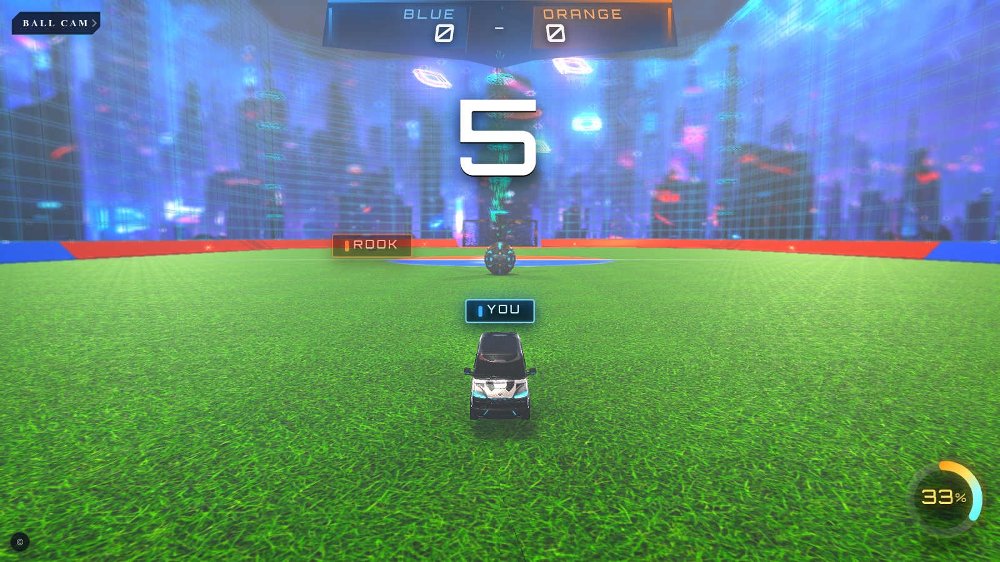
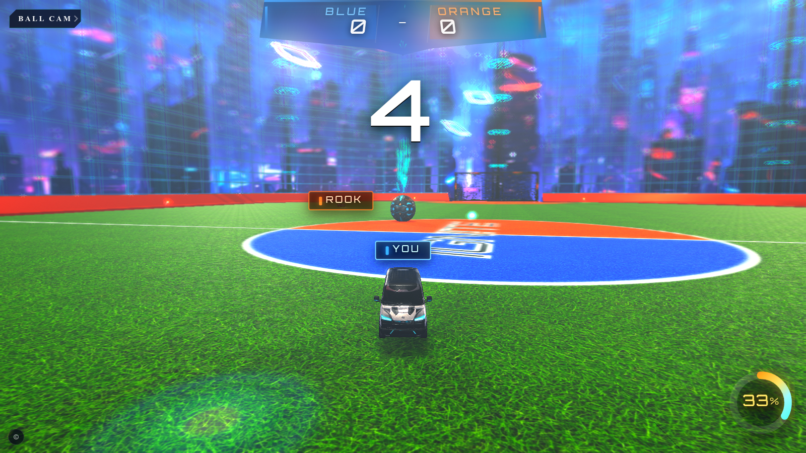
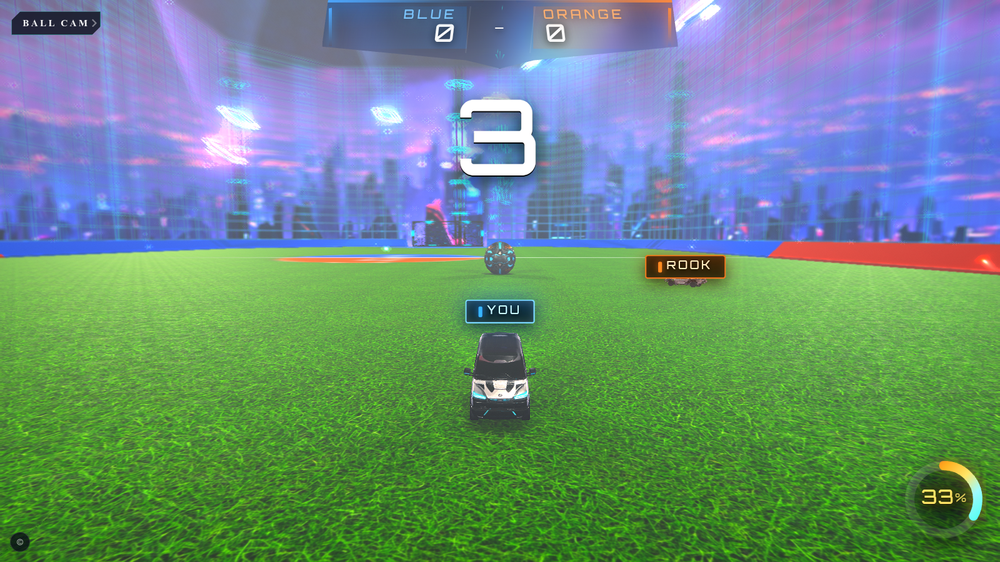
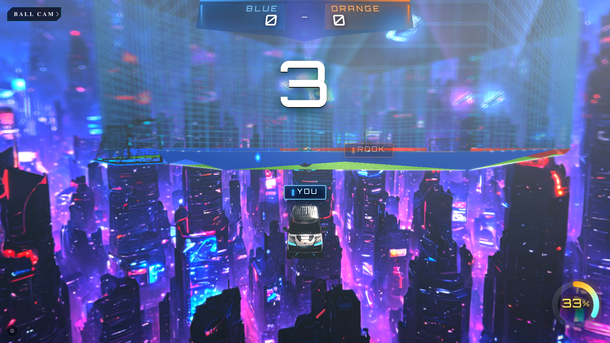
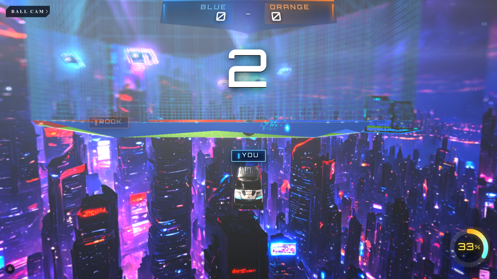
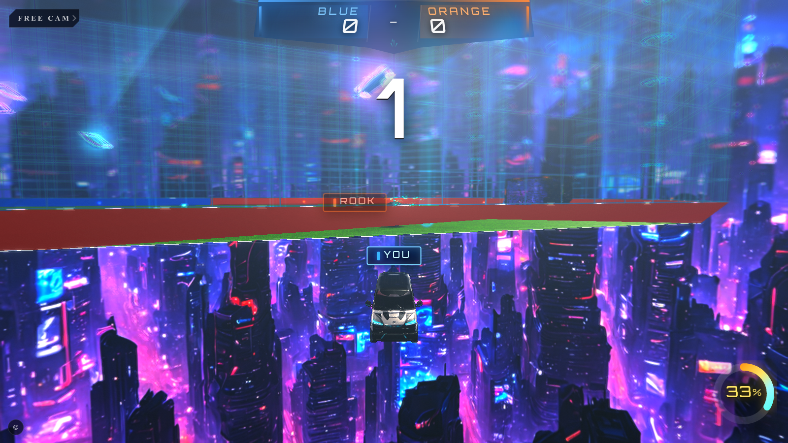
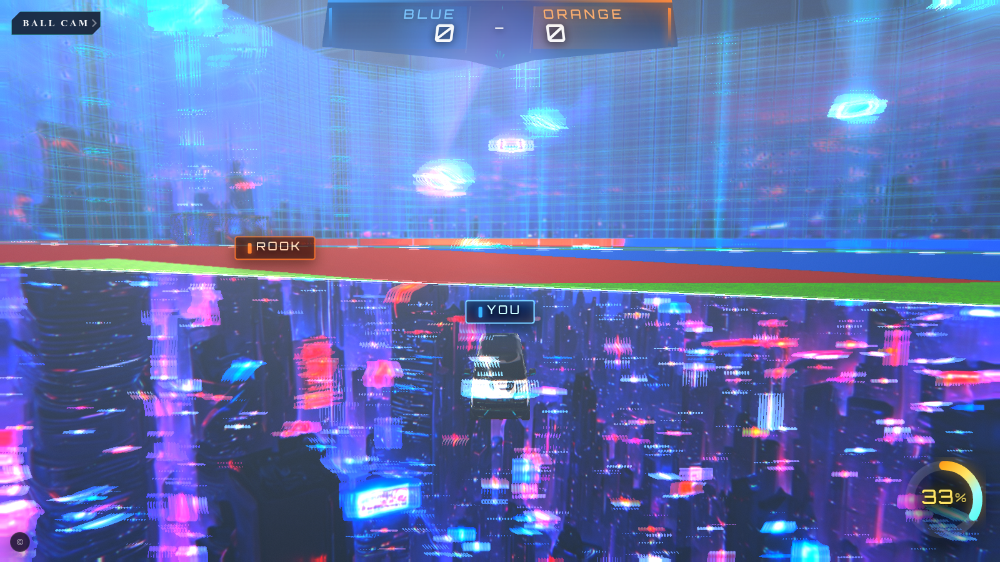
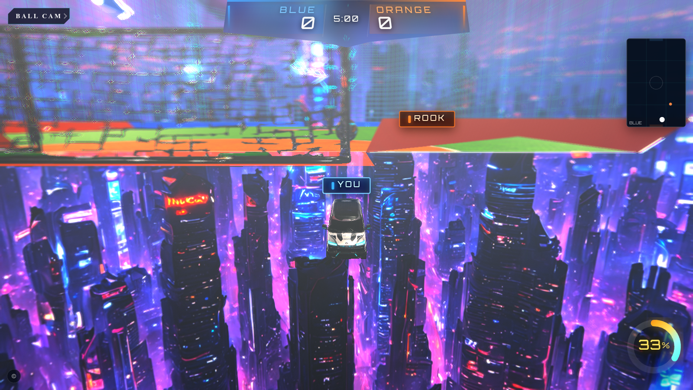
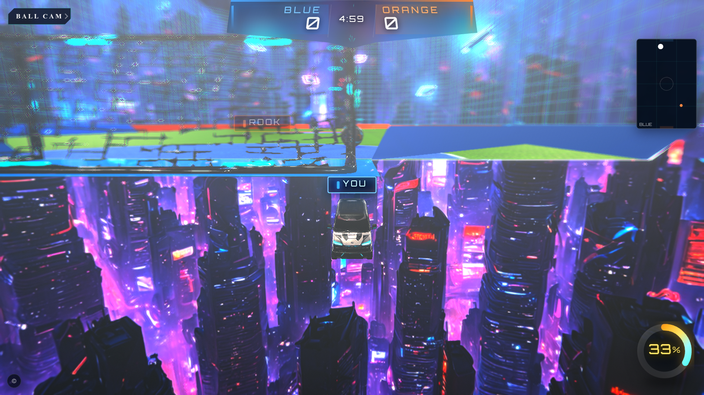
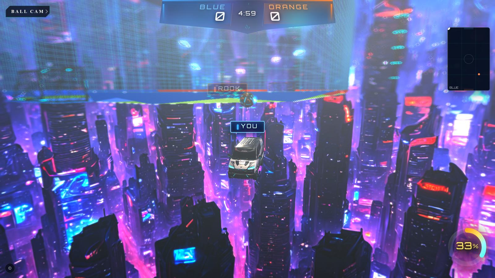

# Chase camera audit

- **PASS:** true
- target: `vite` path: `autostart` survey: true
- fails: —
- screenshot: `/home/adam/Dokumenty/Projekty/Ignite/test-results/chase-camera/chase-vite-autostart-2026-07-17T16-09-18-117Z.png`

## Field survey

### kickoff-blue — PASS

- fails: —
- dist: 6.09
- ndc: {"x":0,"y":-0.38826756191159506,"z":0.966411640184806}
- car: {"x":0,"y":0.44999998807907104,"z":-40}
- cam: {"x":0,"y":2.308749988357226,"z":-45.8,"fov":60.44038501164302,"aspect":1.7777777777777777}
- pixel: {"rgb":[103,107,107],"kind":"other","canvas":"present","washN":4,"grassN":0,"darkN":9,"otherN":12}
- frameWashout: 0.00
- 

### midfield — PASS

- fails: —
- dist: 6.09
- ndc: {"x":-7.219083043267658e-17,"y":-0.38826756191159456,"z":0.9664116401848059}
- car: {"x":0,"y":0.44999998807907104,"z":-14}
- cam: {"x":-1.4349429636762332,"y":2.308749988357226,"z":-19.619692045921738,"fov":60.44038501164302,"aspect":1.7777777777777777}
- pixel: {"rgb":[246,239,232],"kind":"washout","canvas":"present","washN":18,"grassN":0,"darkN":0,"otherN":7}
- frameWashout: 0.00
- 

### orange-half — PASS

- fails: —
- dist: 6.09
- ndc: {"x":0,"y":-0.3882692064402556,"z":0.9664116345955861}
- car: {"x":12,"y":0.4168457090854645,"z":45}
- cam: {"x":12,"y":2.2755965094948065,"z":50.8,"fov":60.44038501164302,"aspect":1.7777777777777777}
- pixel: {"rgb":[216,206,198],"kind":"other","canvas":"present","washN":13,"grassN":0,"darkN":0,"otherN":12}
- frameWashout: 0.04
- 

### blue-corner-L — PASS

- fails: —
- dist: 6.09
- ndc: {"x":5.775266434614124e-16,"y":-0.38826756191159456,"z":0.966411640184806}
- car: {"x":-45,"y":0.44999998807907104,"z":-70}
- cam: {"x":-49.16066532721723,"y":2.308749988357226,"z":-74.04089891421356,"fov":60.44038501164302,"aspect":1.7777777777777777}
- pixel: {"rgb":[215,205,197],"kind":"other","canvas":"present","washN":12,"grassN":0,"darkN":0,"otherN":13}
- frameWashout: 0.00
- 

### blue-corner-R — PASS

- fails: —
- dist: 6.09
- ndc: {"x":-5.775266434614124e-16,"y":-0.38826756191159456,"z":0.966411640184806}
- car: {"x":45,"y":0.44999998807907104,"z":-70}
- cam: {"x":49.16066532721723,"y":2.308749988357226,"z":-74.04089891421356,"fov":60.44038501164302,"aspect":1.7777777777777777}
- pixel: {"rgb":[204,191,183],"kind":"other","canvas":"present","washN":3,"grassN":0,"darkN":0,"otherN":22}
- frameWashout: 0.08
- 

### sideline-L — PASS

- fails: —
- dist: 6.09
- ndc: {"x":5.804043802209462e-16,"y":-0.42304366361700674,"z":0.9662438753085367}
- car: {"x":-55,"y":0.44999998807907104,"z":10}
- cam: {"x":-60.405826792973315,"y":2.299999988079071,"z":7.898325266752295,"fov":60.44038501164302,"aspect":1.7777777777777777}
- pixel: {"rgb":[183,177,174],"kind":"other","canvas":"present","washN":2,"grassN":0,"darkN":0,"otherN":23}
- frameWashout: 0.00
- 

### sideline-R — PASS

- fails: —
- dist: 6.09
- ndc: {"x":-8.662899651921186e-16,"y":-0.38826756191159434,"z":0.966411640184806}
- car: {"x":55,"y":0.44999998807907104,"z":-10}
- cam: {"x":60.405826698609914,"y":2.308749988357226,"z":-12.101674975964707,"fov":60.44038501164302,"aspect":1.7777777777777777}
- pixel: {"rgb":[185,172,163],"kind":"other","canvas":"present","washN":0,"grassN":0,"darkN":0,"otherN":25}
- frameWashout: 0.04
- 

### orange-goal — PASS

- fails: —
- dist: 6.09
- ndc: {"x":0,"y":-0.3882697524262585,"z":0.9664116327399632}
- car: {"x":8,"y":0.4168343245983124,"z":72}
- cam: {"x":8,"y":2.2755853906598533,"z":77.8,"fov":60.44038501164302,"aspect":1.7777777777777777}
- pixel: {"rgb":[230,227,229],"kind":"other","canvas":"present","washN":20,"grassN":0,"darkN":0,"otherN":5}
- frameWashout: 0.04
- 

### blue-goal — PASS

- fails: —
- dist: 6.10
- ndc: {"x":0,"y":-0.3500744210569426,"z":0.966589862365564}
- car: {"x":-8,"y":0.4168343245983124,"z":-72}
- cam: {"x":-8,"y":2.290216830820459,"z":-77.8,"fov":60.44038501164302,"aspect":1.7777777777777777}
- pixel: {"rgb":[229,220,210],"kind":"other","canvas":"present","washN":14,"grassN":0,"darkN":0,"otherN":11}
- frameWashout: 0.00
- 

### near-jupiter — PASS

- fails: —
- dist: 6.07
- ndc: {"x":0.020170280565122607,"y":-0.35361195437084825,"z":0.9664171405315474}
- car: {"x":-50,"y":0.44999998807907104,"z":-80}
- cam: {"x":-52.26329335319535,"y":2.3083276651137146,"z":-85.31400546657589,"fov":60.44038501164302,"aspect":1.7777777777777777}
- pixel: {"rgb":[166,165,166],"kind":"other","canvas":"present","washN":7,"grassN":0,"darkN":0,"otherN":18}
- frameWashout: 0.00
- 
